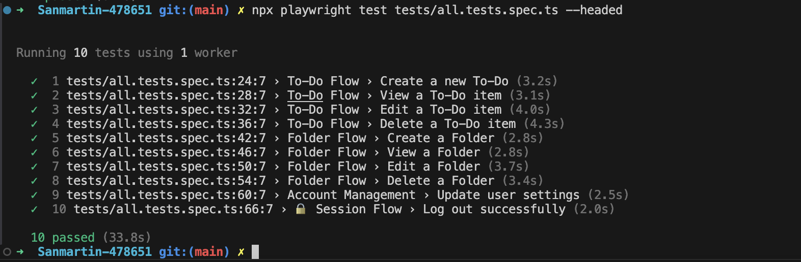

# ✅ QA Challenge – Ensolvers

This repository contains a suite of automated end-to-end (E2E) tests designed to validate the core functionalities of the [QA Challenge](https://qa-challenge.ensolvers.com) application using [Playwright](https://playwright.dev/).

---

## 🧪 What is being tested?

The test suite covers:

### 📝 To-Do Flow

- Create a To-Do item
- View To-Do item details
- Edit an existing To-Do item
- Delete a To-Do item

### 📂 Folder Flow

- Create a Folder
- View Folder details
- Edit a Folder
- Delete a Folder

### ⚙️ Account Management

- Update user settings (first name, last name, email)

### 🔒 Session Flow

- Log in
- Log out

---

## How to run the tests

### 1. Install dependencies

```bash
npm install
```

### 2. Install Playwright browsers

```bash
npx playwright install --with-deps
```

### 3. Run the entire test suite

```bash
npx playwright test
```

### 4. Run the entire test suite

```bash
npx playwright test --headed
```

### 5. Run a specific test file

```bash
npx playwright test tests/CreateToDo/index.ts
```

## Practices Followed

- Each test is modularized in its own isolated file
- Global login handled in `beforeEach` for efficiency
- Strong locators using `data-cy`, `getByRole` and robust filters
- Reusable login/logout utilities
- Pagination logic included where necessary to assert visibility

---

## Notes

- All tests assume default credentials: `user / user`
- Tested on Chrome `v123`, macOS

✅ Feel free to fork, extend, or adapt the flow to your own QA process.

## Test Suite Result



---

## Demo Video

<video src="./assets/SuiteCompleted.mov" width="700" controls autoplay muted loop></video>
